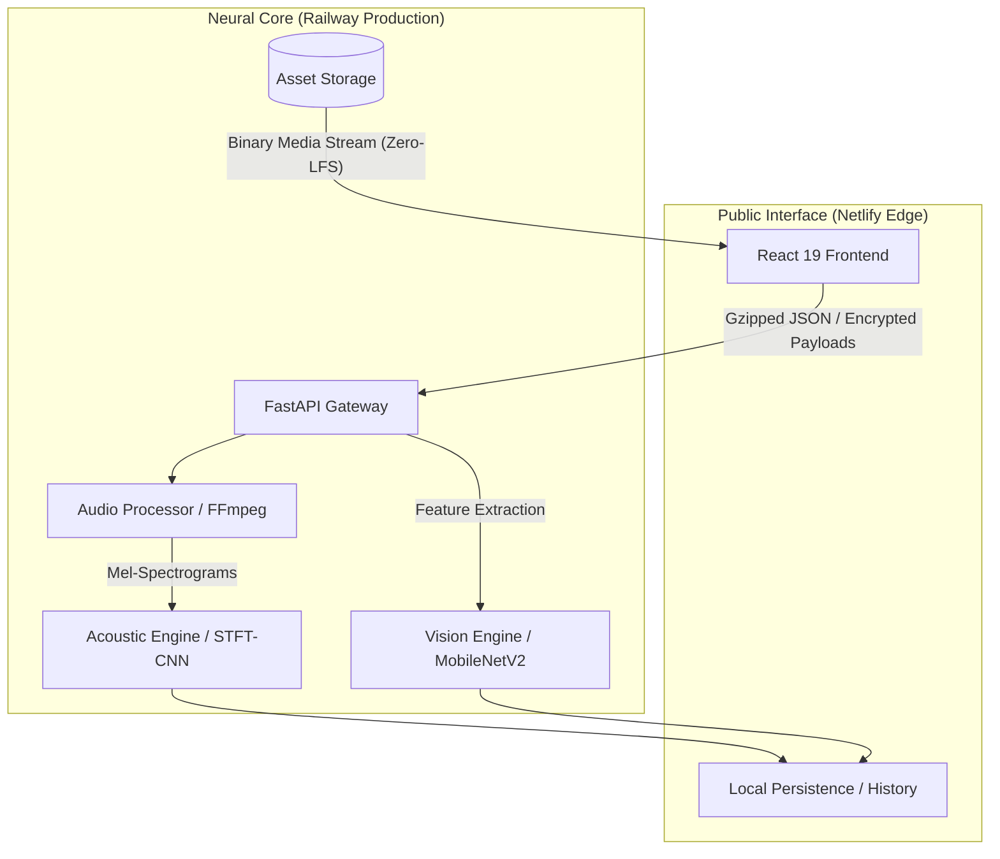
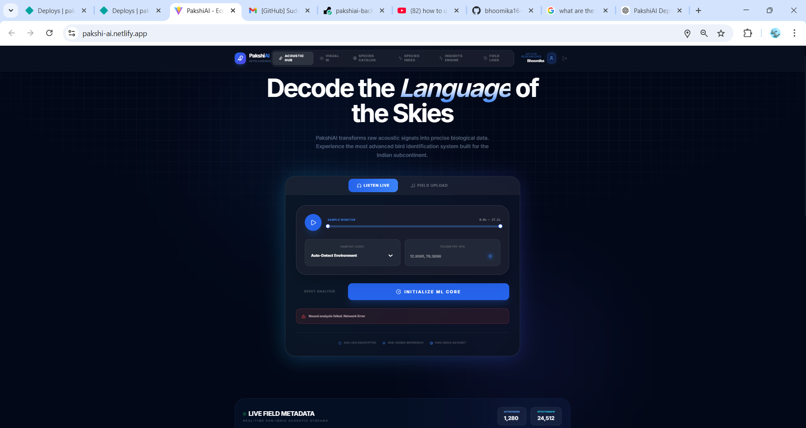
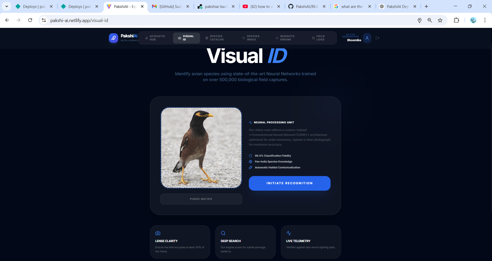
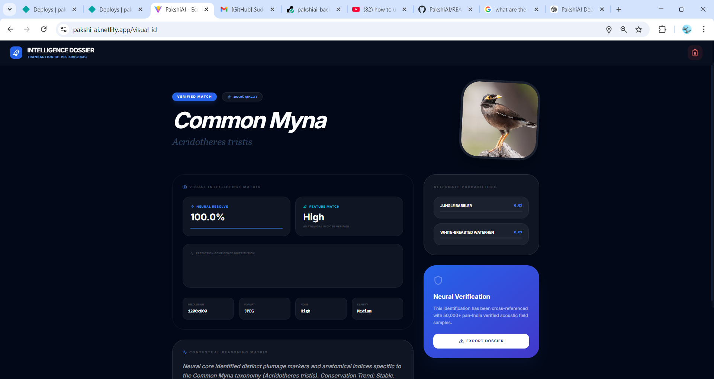
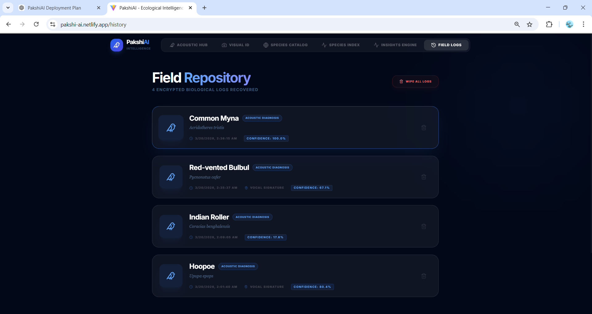
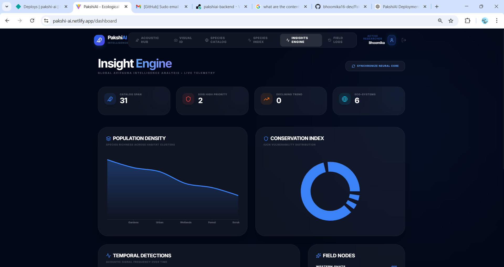
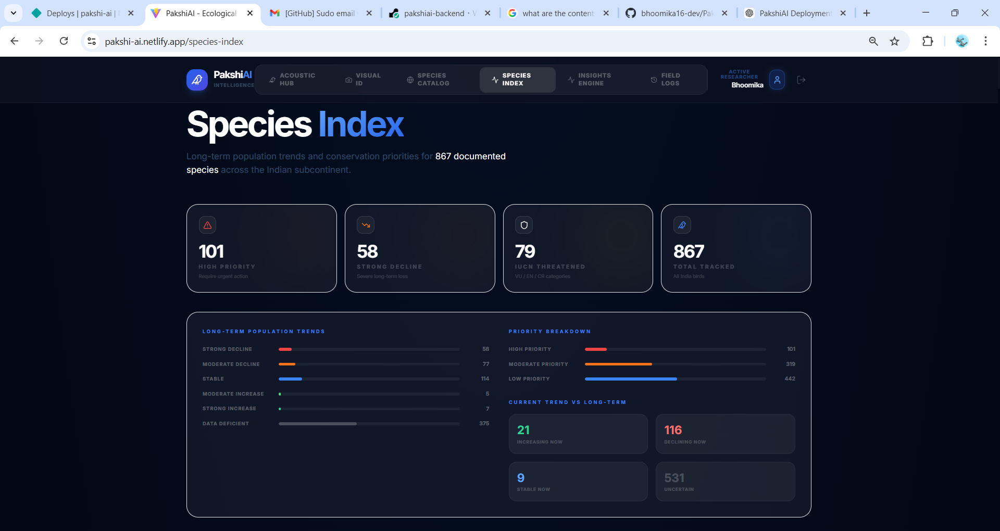

# PakshiAI - Automated Avifauna Intelligence Platform 🦜🚀

[](https://railway.app/)
[](https://netlify.com/)
[](#technical-stack)
[](https://fastapi.tiangolo.com/)

**PakshiAI** is an industrial-grade Ecological Intelligence system designed for the high-fidelity monitoring of Indian avian species. Utilizing state-of-the-art **Convolutional Neural Networks (CNN)**, the platform provides real-time acoustic vocalization analysis and visual pattern recognition, bridging the gap between field observation and structured biological data.

---

## 📖 Strategic Overview
- [Ecosystem Vision](#-ecosystem-vision)
- [Production Architecture](#️-production-architecture)
- [Neural Identification Hub](#-neural-identification-hub)
- [Technical Specification](#-technical-specification)
- [Deployment & Synchronization](#-deployment--synchronization)
- [Field Research Guide](#-field-research-guide)

---

## 🌍 Ecosystem Vision
Avian species are the primary bioindicators of ecosystem health. PakshiAI automates the labor-intensive process of biodiversity auditing, enabling researchers to:
- **Digitize Field Logs**: Automated species identification from raw audio and images.
- **Trend Analysis**: Monitor population density and conservation status through real-time telemetry.
- **Conservation Hardening**: Focus resources on high-priority species as identified by the latest **SoIB (State of India's Birds)** data.

---

## 🏗️ Production Architecture

PakshiAI operates on a **Decoupled Hybrid-Cloud** architecture, optimizing for both low-latency UI responsiveness and heavy neural inference.



---

## 🚀 Neural Identification Hub

### 🎧 Acoustic Synthesis Hub
Analyzes bird calls via **Short-Time Fourier Transform (STFT)**. The engine identifies vocal signatures using deep spectral correlation across 31 endemic species.
- **Segmented Analysis**: 30-second windowing for file stability.
- **Neural Lazy-Loading**: Optimized 120s timeout protection.
> 

### 📸 Visual Recognition Core
Leverages **MobileNetV2** for plumage and anatomical descriptor extraction. 
- **Fuzzy-Match Logic**: Robust nomenclature synchronization between neural labels and the species catalog.
- **High-Fidelity Results**: Instant metadata retrieval for identified visual markers.
> 
> 

### 📚 Field Repository (History Tracker)
A persistent log of all avian detections and field observations, enabling researchers to review previous acoustic and visual identification commits.
> 

### 📊 Insight Engine (Dashboard)
Live telemetry visualizing biodiversity trends, regional detection hotspots, and IUCN conservation distribution.
> 
> 

---

## 🛠️ Technical Specification

### **Machine Learning Framework**
- **Neural Core**: PyTorch (MobileNetV2 & Custom CNN Architectures).
- **Signal Processing**: Librosa (Acoustic decomposition), NumPy, SciPy.
- **Data Pipeline**: Binary-Asset-Sync (Bypassing Git LFS for production latency).

### **Infrastructure & Backend**
- **Gateway**: FastAPI (Async high-performance Python).
- **Assets**: Optimized Static serving with cache-control headers.
- **Database**: SQL-Alchemy ORM / SQLite for production logging.

### **Frontend Research UI**
- **Framework**: React 19 + Vite.
- **Motion Engine**: Framer Motion for non-blocking UI transitions.
- **Visualization**: Recharts for terminal-grade telemetry.

---

## 🔧 Field Research Guide (Local Setup)

### **Prerequisites**
- **Python 3.10+** & **Node.js 18+**
- **FFmpeg** (Crucial for acoustic spectral analysis)

### **Automated Deployment (Windows)**
The project includes a unified launcher for instant local research:
```powershell
./start_local.bat
```
*This command synchronizes neural weights, initializes the API core, and launches the research interface concurrently.*

### **Manual Backend Initialization**
```bash
pip install -r requirements.txt
python backend/app.py
```

### **Manual Frontend Initialization**
```bash
cd frontend
npm install
npm run dev
```

---

## ⚙️ Global Synchronization

| Variable | Target | Deployment Environment |
|----------|--------|------------------------|
| `VITE_API_BASE_URL` | https://pakshiai-backend-production.up.railway.app | **Production Tier** |
| `VITE_API_BASE_URL` | http://localhost:8000 | **Local Research** |

---

## 🗺️ Roadmap
- [x] **Railway Migration**: Production RAM stability (RESTORED).
- [x] **Binary-Asset-Sync**: LFS-to-Blob conversion for zero-latency images.
- [ ] **PWA Deployment**: Offline-first mobile field tool.
- [ ] **Endemic expansion**: Support for 100+ Western Ghats endemics.

---

## 🤝 Project Stewardship
**Maintainer**: [Bhoomikha](https://github.com/bhoomika16-dev)  
**Production Site**: [PakshiAI Live](https://pakshi-ai.netlify.app)

*Designed for Conservation through Intelligence.* 🦜🕊️🎊
