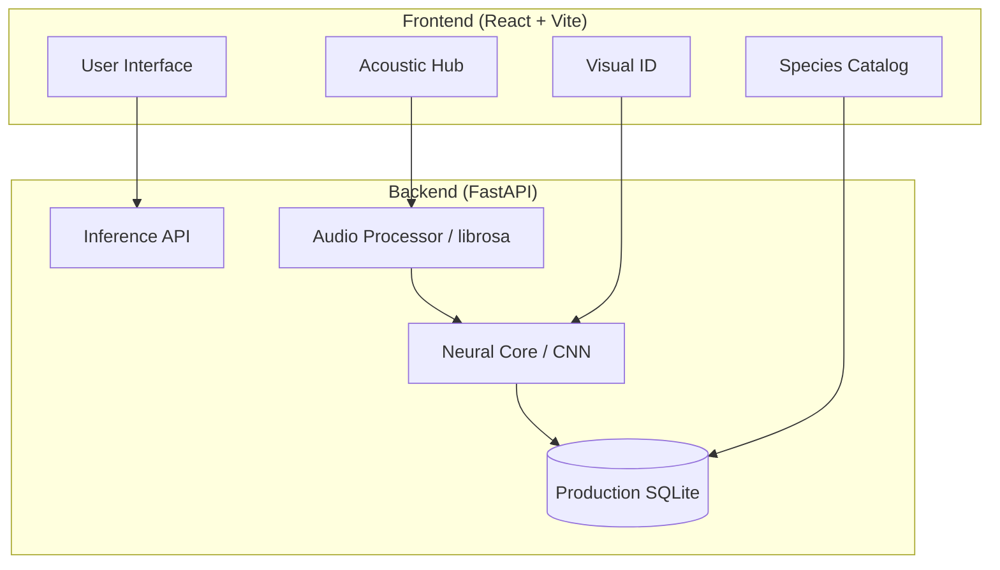

# PakshiAI - Ecological Intelligence Platform 🦜

[](https://www.python.org/)
[](https://fastapi.tiangolo.com/)
[](https://reactjs.org/)
[](#technical-stack)
[](https://opensource.org/licenses/MIT)

**PakshiAI** is a professional-grade Ecological Intelligence system designed for the automated monitoring of Indian avifauna. By leveraging **Convolutional Neural Networks (CNN)**, the platform provides real-time acoustic and visual species identification, empowering conservationists and researchers with high-fidelity biodiversity data.

---

## 📖 Table of Contents
- [Problem Statement](#-problem-statement)
- [System Architecture](#️-system-architecture)
- [Technical Stack](#-technical-stack)
- [Features](#-features)
- [Installation](#-installation)
- [Usage](#-usage)
- [Configuration](#️-configuration)
- [Roadmap](#-roadmap)
- [Contributing](#-contributing)
- [License](#-license)

---

## 🌍 Problem Statement
Avian species serve as critical bioindicators of ecosystem health. However, manual monitoring is labor-intensive, costly, and often prone to human error across vast Indian landscapes. 

**PakshiAI** bridges this gap by providing an AI-driven, scalable solution. It transforms raw field captures (audio/images) into actionable intelligence, enabling:
- **Rapid Biodiversity Assessment**: Identifying species in seconds, not hours.
- **Digital Conservation Records**: Logging predictions with geospatial and habitat context.
- **Public Engagement**: Making complex ornithological data accessible via a professional UI.

---

## 🏗️ System Architecture

PakshiAI utilizes a **training-inference separation** strategy. While the research was conducted on an ~11GB dataset, the production environment is optimized for high-performance inference using serialized weights.



---

## 🛠️ Technical Stack

### **Neural Core (Deep Learning)**
- **Architecture**: Convolutional Neural Networks (CNN) optimized for spectral and pattern recognition.
- **Inference**: PyTorch (CPU-Optimized).
- **Processing**: Librosa (STFT, Mel-Spectrogram decomposition), NumPy, SciPy.

### **Backend (Intelligence Engine)**
- **Framework**: FastAPI (High-performance Async Python).
- **Database**: SQLAlchemy (ORM) + SQLite (Production-ready logging).
- **Server**: Uvicorn / Gunicorn.

### **Frontend (Research Interface)**
- **Framework**: React 19 + Vite (Next-gen bundling).
- **Styling**: TailwindCSS (Modern utility-first system).
- **Animations**: Framer Motion (Smooth UI state transitions).
- **Visualization**: Recharts & Lucide.

---

## ✨ Features

### 🎧 Acoustic Hub
Neural spectral analysis of bird calls. Upload field recordings to decode vocal signatures with detailed confidence intervals.
> *Placeholder: [Acoustic Hub Dashboard Screenshot]*

### 📸 Visual ID
State-of-the-art computer vision engine for identifying species from field captures, focusing on plumage patterns and anatomical markers.
> *Placeholder: [Visual ID Results Screenshot]*

### 📚 Species Catalog
A comprehensive encyclopedia of 31+ verified Indian avian species, including scientific nomenclature, frequency ranges, and ecological context.
> *Placeholder: [Species Catalog Screenshot]*

### 📊 Real-time Monitoring & Dashboard
Visual telemetry tracking biodiversity trends, detection activity, and geospatial distribution.

---

## 🚀 Installation

### **Prerequisites**
- **Python 3.10+** (Inference Core)
- **Node.js 18+** (Interface)
- **FFmpeg** (Required for spectral audio processing)

### **Step-by-Step Setup**

1. **Clone the Repository**
   ```bash
   git clone https://github.com/bhoomika16-dev/PakshiAI.git
   cd PakshiAI
   ```

2. **Backend Setup**
   ```bash
   # We recommend using the provided automated launcher
   # but for manual setup:
   pip install -r requirements.txt
   ```

3. **Frontend Setup**
   ```bash
   cd frontend
   cp .env.example .env
   npm install
   ```

### **Running the Project (Local Research Mode)**
For a professional experience on Windows, simply double-click:
```powershell
start_local.bat
```
*This launches the API and UI concurrently with automated dependency synchronization.*

---

## ⚙️ Configuration

| Variable | Description | Default |
|----------|-------------|---------|
| `VITE_API_BASE_URL` | Link to the FastAPI Backend | `http://localhost:8000` |
| `DATABASE_URL` | SQLAlchemy Connection String | `sqlite:///./pakshiai.db` |

The backend expects trained `.pth` models in `backend/models/`. These are automatically handled in the provided repository.

---

## 🗺️ Roadmap
- [ ] **Mobile Integration**: Progressive Web App (PWA) for offline field use.
- [ ] **Edge Deployment**: Porting CNN cores to TensorFlow Lite for ultra-low latency.
- [ ] **Extended Repository**: Expanding to 100+ Western Ghats endemic species.
- [ ] **Citizen Science API**: Allowing verified experts to contribute to dataset refinement.

---

## 🤝 Contributing
Contributions are what make the open-source community such an amazing place to learn, inspire, and create.

1. **Fork** the Project
2. Create your **Feature Branch** (`git checkout -b feature/AmazingFeature`)
3. **Commit** your Changes (`git commit -m 'Add some AmazingFeature'`)
4. **Push** to the Branch (`git push origin feature/AmazingFeature`)
5. Open a **Pull Request**

---

## 📜 License
Distributed under the **MIT License**. See `LICENSE` for more information.

---

## 📞 Support & Contact
**Project Maintainer**: [Bhoomikha](https://github.com/bhoomika16-dev)  
**Project Link**: [https://github.com/bhoomika16-dev/PakshiAI](https://github.com/bhoomika16-dev/PakshiAI)  

*For bug reports and feature requests, please use the [GitHub Issues](https://github.com/bhoomika16-dev/PakshiAI/issues) page.*

---
**PakshiAI** - *Conservation through Intelligence*
