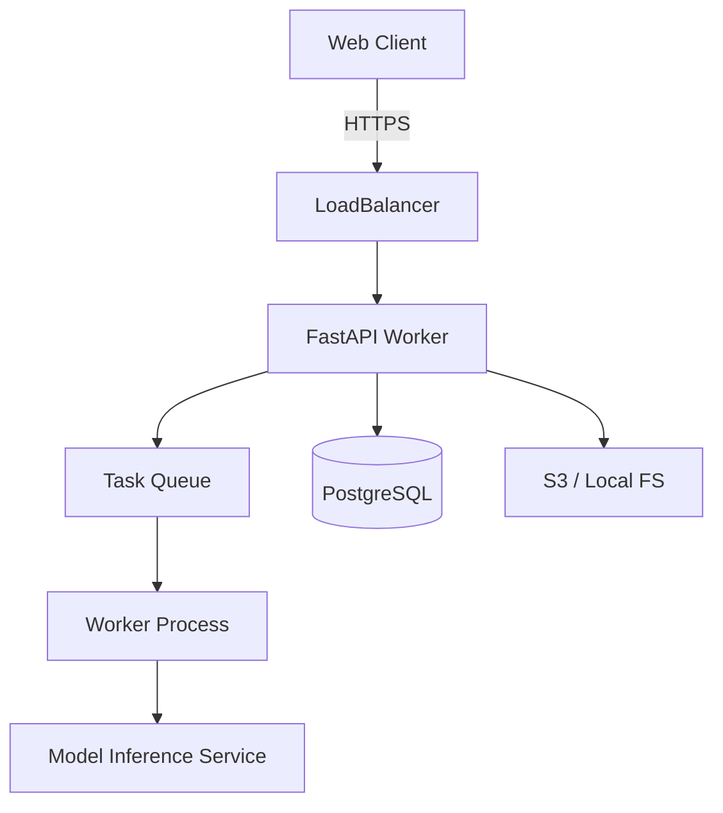

# PakshiAI - System Architecture

## Architecture Overview

PakshiAI employs a modular layered architecture to separate concerns between user interaction, data processing, intelligence engine, and persistence.

### 1. Presentation Layer (Frontend)
- **Framework**: React 18, Vite.
- **Styling**: TailwindCSS (Utility-first CSS).
- **Visualization**: HTML5 Canvas (Spectrograms), Recharts (D3-based Analytics).
- **Functionality**:
    *   `AudioInput.jsx`: Handles microphone capture (Web Audio API) and file validation.
    *   `AnalysisResult.jsx`: Displays ML predictions, confidence scores, and reasoning.
    *   `Dashboard.jsx`: Fetches `/api/stats` for aggregated insights.
    *   `api.js`: Axios-based client for interacting with the backend.

### 2. Application Layer (Backend API)
- **Framework**: FastAPI (Python 3.10+).
- **API Flow**:
    1.  **Ingestion**: `/api/upload` receives raw audio.
    2.  **Validation**: Checks MIME type, size.
    3.  **Processing**: Pipes to `AudioProcessor`.
    4.  **Logging**: Stores metadata in SQLite (via SQLAlchemy).

### 3. Intelligence Layer (Core Logic)
- **Audio Processing (`core/audio_processor.py`)**:
    *   **Standardization**: Resamples to 32kHz, Mono.
    *   **Preprocessing**: Normalizes volume, trims silence (Librosa).
    *   **Feature Extraction**: Generates Mel-Spectrogram (128 bins), MFCC (13 coeffs), Spectral Centroid.
- **Inference Engine (`core/ml_engine.py`)**:
    *   Mock implementation simulating a Hybrid CNN-RNN model.
    *   Returns raw probabilities per species.
- **Context Engine (`core/context_engine.py`)**:
    *   **Purpose**: Adjusts raw probabilities using environmental context.
    *   **Inputs**: Date (Migration Calendar), Lat/Long (Range Map), Habitat (Forest/Urban/etc).
    *   **Logic**: Boosts scores for compatible contexts; penalizes mismatches.

### 4. Data Layer (Persistence)
- **Database**: SQLite (Development), PostgreSQL (Production target).
- **Schemas (`models.py`)**:
    *   `User`: Authentication & Roles.
    *   `Recording`: Metadata, file paths, raw/processed status.
    *   `Prediction`: Stores species ID, confidence, adjusted score, reasoning.
    *   `Species`: Taxonomy, conservation status, habitat preferences.
- **Storage**: Local filesystem for audio blobs (`uploads/`, `processed/`).

## Deployment View

## Security Considerations
- **Input Validation**: Strict file type checking (magic bytes in future).
- **Rate Limiting**: Prevent API abuse.
- **Storage**: Filenames are UUIDs to prevent directory traversal.
- **Privacy**: User data encrypted at rest; recordings anonymized for research.

## Performance
- **Async Handling**: FastAPI handles heavy I/O asynchronously.
- **Caching**: Future improvements will include Redis caching for frequent queries.
- **Optimization**: Audio processing runs as background tasks in production (Celery/RQ).
